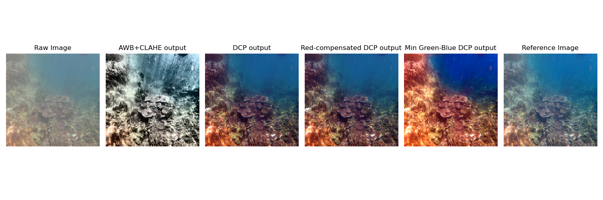
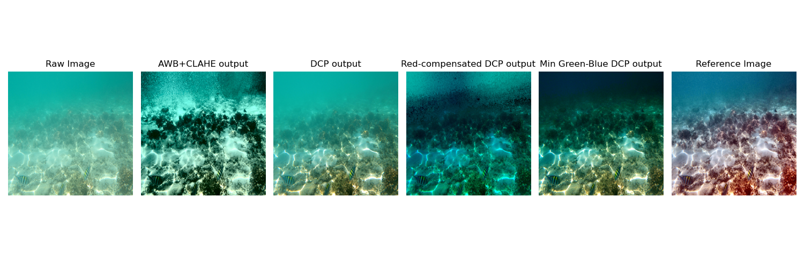
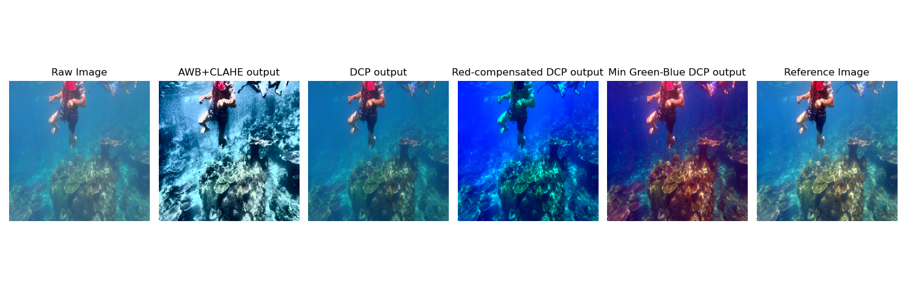
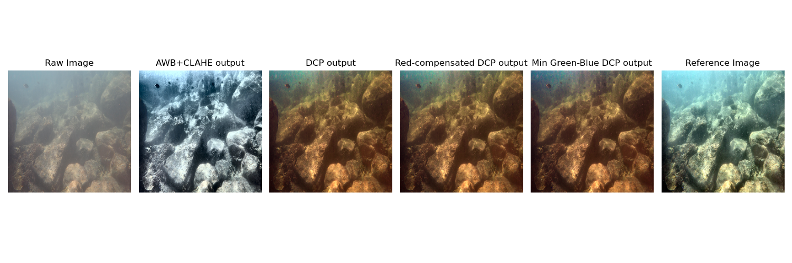

To evaluate the performance of the implemented underwater image enhancement models, three metrics are used:
1) PSNR (Peak Signal-to-Noise Ratio)
2) SSIM (Structural Similarity Index Measure)
3) UIQM (Underwater Image Quality Measure)
The first two metrics require reference images, while the third is a no-reference underwater image quality index.

NOTE: The reference images in the dataset were created using Deep Learning based enhancement methods and hence classical methods cannot exactly reproduce the reference images. So SSIM and PSNR values are not always accurately reflecting the perceptual improvement produced by the classical methods. Therefore, while PSNR and SSIM are reported for completeness, UIQM is a more meaningful metric for under water image enhancement algorithms.

The Mean UIQM of raw images in the dataset is 0.9856293082993665

The detailed results:

| Model | Mean PSNR  | Std PSNR | Mean SSIM | Std SSIM | Mean UIQM of output | Std UIQM of output |
| ------ | ------ | ------ | ------ | ------ | ------ | ------ |
| AWB + CLAHE | 14.491 | 2.084 | 0.659 | 0.132 | 2.189 | 0.444 |
| Basic Dark Channel Prior(DCP) | 6.063 | 1.135 | 0.011 | 0.022 | 1.291 | 0.541 |
| Red channel compensated DCP | 6.061 | 1.135 | 0.010 | 0.022 | 1.393 | 0.546 |
| Min Green-Blue DCP | 6.059 | 1.135 | 0.010 | 0.022 | 1.699 | 0.517 |

#### Interpretation:

In terms of UIQM, all enhancement methods improve the UIQM score compared to the raw images.

AWB+CLAHE model achieved highest UIQM, which indicates strong improvements in contrast and color balance.

Among the Dark Channel Prior based methods, the Min Green-Blue DCP produces a higher UIQM score compared to basic DCP variants, suggesting that removing the red channel bias imporves perceptual quality.

#### Few Sample Outputs:

